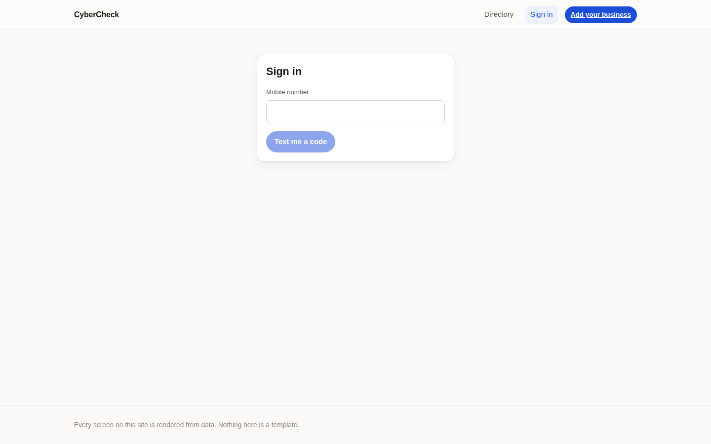
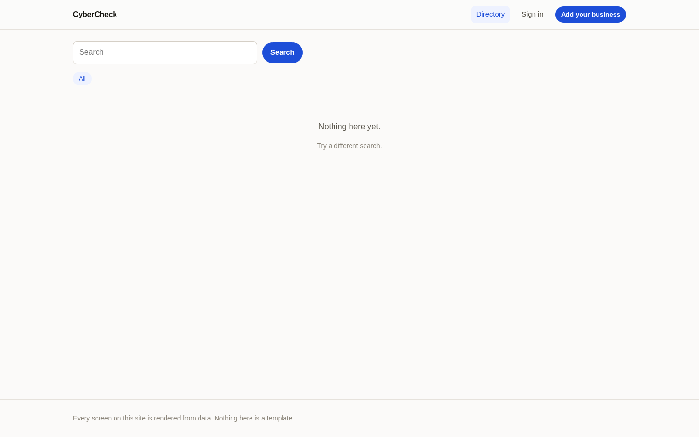

> **Status: an earlier front end, not deployed and not part of Ghost.** One front
> end where every screen is drawn from data by 13 renderers, no page per business
> type. `npm run verify` (no-hardwiring check, tests, build) passes. It is a
> Vite + React app whose only network target is the `gcr-api-clean` API
> (`src/config.js`, `src/lib/api.js`); the current owner dashboard is
> `Dashboards-users-`.

| Sign in | Directory |
| --- | --- |
|  |  |

*Run locally with a test backend that returns no businesses, so the directory
shows its empty state.*

---

# cybercheck-web

One front end. Every screen is rendered from data.

There is no page in this repo for a restaurant, none for a charter boat, none
for a salon, and none for a business that signs up next month. There are
**thirteen renderers**, each of which draws a *shape* of data, and a function
that works out which shape a set of rows is. A restaurant's `menu_items`, a
salon's `service_menu`, a hotel's `room_types` and a table nobody has invented
yet are all "rows with a name and a price", so all four get the same designed
layout — and none of the four is named anywhere in `src/`.

`npm run check` fails if that stops being true, and `npm run verify` runs it before the build.

---

## How it works

```
GET /api/gcr/entity/:slug          public profile
GET /api/business/sections         owner dashboard
        │
        ▼
   discover(payload)               which parts have content, and in what order
        │
        ▼
   shapeOf(rows)                   what does this look like?
        │
        ▼
   rendererFor(shape)              gallery · hours · pricelist · reviews · …
        │
        ▼
   <Block />                       one heading, one renderer
```

Both surfaces run that same pipeline and the same `<Block />`. What the owner's
version adds is editing controls: an Add button in each heading, an Edit button
per row under each block, and a side list of sections that can still be added.
It has no `Hero` header. That is deliberate: two implementations of "show a
menu" drift apart, and then the owner is editing something that does not look
like what anyone sees.

### Nothing is hardwired, and it is checked

`scripts/check-no-hardwiring.mjs` walks `src/` and fails on:

| rule | what it forbids |
| --- | --- |
| `no-url-literals` | a hostname anywhere but `src/config.js`, which reads it from the environment |
| `no-slug-branches` | `slug === '…'` — a branch on one particular business |
| `no-industry-branches` | `entity_type === '…'` — one industry in the code and the rest left out |
| `no-table-name-branches` | choosing a renderer by table name instead of by shape |
| `no-section-lists` | a literal list of section or table names — that is a list of the businesses this app supports |
| `surfaces-use-the-registry` | a page importing a renderer directly and deciding what a section looks like |
| `fallback-required` | the registry must handle a shape nobody anticipated |
| `runtime-override-required` | a package must be able to replace a renderer without editing the registry |

It caught a five-item list in `Hero.jsx` the first time it ran. That list is
gone; the chips under a heading are now derived from whatever short fields the
record happens to carry.

### The parts

```
src/config.js               what this app may know before it calls the API: where the API is, plus the optional single-business slug and site name
src/lib/endpoints.js        every path, in one file
src/lib/api.js              the only fetch; holds the session, refreshes once on a 401
src/lib/shape.js            roleOf(column) and shapeOf(rows) — the detection
src/lib/discover.js         payload -> ordered blocks, for both surfaces
src/blocks/registry.jsx     shape -> renderer, plus registerBlock() for packages
src/blocks/renderers.jsx    the thirteen renderers
src/blocks/Block.jsx        one heading + the renderer for the block's shape
src/blocks/Hero.jsx         the top of a public profile, built from the record's scalar fields
src/lib/viewlet.js          views as data (descriptor / viewlet / preference); tested, but not yet used by any surface
src/blocks/RowEditor.jsx    a form for any table, built from the live schema
src/surfaces/               Directory, PublicProfile, OwnerDashboard, AppStore, SignIn, SignUp
scripts/check-no-hardwiring.mjs
scripts/probe.mjs           run the real pipeline against the real API
tests/shape.test.mjs        25 checks, no network
tests/viewlet.test.mjs      13 checks, no network
```

### Ordering

A block's position comes from the owner when the API returns one
(`entity_modules` rows carry `module_key`, `enabled` and `sort_order`), and
from the shape's natural prominence when it does not. A module marked
`enabled: false` is not rendered. Neither path involves a list in this repo.

### The owner's editor

`RowEditor` builds its fields from `GET /api/business/schema`, which the API
computes from PostgREST's live OpenAPI document. A column added to the
database this afternoon is an input this evening, with nothing rebuilt. The
dashboard's "add a section" list is the live table list minus what the
business already has — so every table is reachable, and none is enumerated
here.

### Two deployments, one build

| | `VITE_SINGLE_BUSINESS_SLUG` | `/` | `/b/:slug` |
| --- | --- | --- | --- |
| directory | empty | list of businesses | one business |
| single business | set | that business | that same business (the slug in the URL is ignored) |

The owner routes are identical either way, because no owner path carries a
slug: the API resolves which business a session owns from `entity_owners`, and
there is nothing in a request that can change the answer.

---

## Running it

```bash
cp .env.example .env        # set VITE_API_BASE (optional: VITE_SINGLE_BUSINESS_SLUG, VITE_SITE_NAME)
npm install
npm run dev
```

```bash
npm run check       # the hardwiring rules
npm test            # 25 shape-detection + 13 viewlet checks, no network
npm run verify      # check + test + build
```

Against live data:

```bash
node scripts/probe.mjs https://your-api.example.com some-slug
```

That prints every block the page would draw and the shape each one resolved
to, plus how many fell through to the generic table. A block that falls
through is a **shape worth adding to `lib/shape.js`** — never a page worth
writing.

## Adding a layout

Two edits, and every business gets it at once:

1. a detector in `SHAPES` in `src/lib/shape.js`
2. a renderer component in `src/blocks/renderers.jsx`, registered in
   `src/blocks/registry.jsx`

Optionally add the shape to `SHAPE_WEIGHT` in `src/lib/shape.js`; without an
entry it sorts last. No surface changes. Nothing is registered per business. A package or a
white-label build that wants to replace one calls `registerBlock(shape, C)`
at runtime instead of editing the registry at all.
